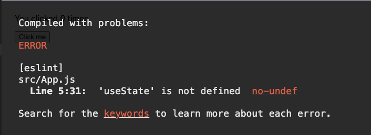

This repository illustrates how React's useState could be implemented. The purpose is to illustrate how the real useState works and why to help developers get the correct mental model

The rest of this document contains my “speaker notes” for a presentation during the Front-End Dev Guild monthly meeting. 

I wrote these notes as part of my preparation for the presentation. I’m sharing them in case someone finds them useful, but I haven’t edited them in any way to make them more readable.

# Speaker Notes
## What we will talk about today
With the introduction of hooks in version 16.8, React introduced a nicer-looking and cleaner mechanism to handle state and side effects using functional components instead of classes  
Although I strongly believe hooks are usually overused as it is a best practice to separate the View from the application logic, that is a topic for another time. Today, I would like to talk about useState and specially, discuss how it works internally  
The goal is not to get into all the details and intricacies of the actual implementation but to develop a mental model for the overall mechanism React uses to make useState works  
This is crucial as, unfortunately, we need to know to a certain level how React works as having the wrong model causes us to misunderstand how React works and therefore introduce bugs.

## Our approach to develop a mental model for how useState works
One way to understand how a software feature works is to go over the code - i.e., looking at the solution. This is certainly a good and valid approach that can give us a deep and detailed understanding of how it works.
However, today I'll like to take an alternative approach and focus instead on implementing useState from scratch and come up with our own solutions instead of studying an existing one. This would help us get a better perspective on the issues and constraints the React faced during their implementation so we can better understand why they did things the way they did it  

This would us help to understand, for example, why:  
•	React has the rules it has for hooks (see [Rules of Hooks](https://reactjs.org/docs/hooks-rules.html)).
•	Changes in the state don't happen immediately  

The goal, again, is not a complete understanding of the implementation but to create the correct mental model for how useState works that would allow to use it effectively and without bugs  

Our goal is not a complete and optimal implementation but something simple enough to be done quickly but also realistic enough to expose us to the constrains and decisions the React team encountered while implementing useState.

If you find this approach useful, then we can try to do the same for other hooks, such as useEffect, or for other critical React features such as re-renders, component lifecycle, etc.

## Sample React app to test our useState
I'll use the example React's documentation uses to introduce hooks at as sample code that uses useState. 
Our initial goal is to run this sample code with our implementation of useState and get the exact same behavior as
if it were using the original one provided by React.

I used create-react-app to stand up a skeleton react application and copied the sample code on [React intro page](https://reactjs.org/docs/hooks-intro.html) to my App.js.
I also added a line at the end to export my component as default so it get rendered by the index.js generated by create-react-app. 

```js
// App.js
import React, { useState } from 'react';

function Example() {
    // Declare a new state variable, which we'll call "count"
    const [count, setCount] = useState(0);

    return (
        <div>
            <p>You clicked {count} times</p>
            <button onClick={() => setCount(count + 1)}>
                Click me
            </button>
        </div>
    );
}

export default Example
```

```js
// index.js
import React from 'react';
import ReactDOM from 'react-dom/client';
import './index.css';
import App from './App';
import reportWebVitals from './reportWebVitals';

const root = ReactDOM.createRoot(document.getElementById('root'));
root.render(
        <React.StrictMode>
          <App />
        </React.StrictMode>
);
```

If we run this, I see the value of the counter and a button to increment it


If we click on the button, the value increases by one


This is working as expected. Now we want to do the same with our version…

## Let’s pretend useState does not exist (yet)
Suppose useState is not something React provided,
maybe because we are still using an older version that doesn’t support hooks so we cannot import useState from React.

```js
import React from 'react';

function Example() {
    // Declare a new state variable, which we'll call "count"
    const [count, setCount] = useState(0);

    return (
        <div>
            <p>You clicked {count} times</p>
            <button onClick={() => setCount(count + 1)}>
                Click me
            </button>
        </div>
    );
}
```
If we remove useState from the import and try to compile, we get an error:



## Fixing the compile error
Let's fix it by creating a skeleton useState function that:
-	takes an initial value (or function, but we will ignore this for now)
-	returns an array containing the current value and a function to set a new value

```js
const useState = initialValue => {
    const setValue = (newValue) => 
           console.log('setValue called with', newValue) 
    
    return [initialValue, setValue]
}
```
If we run it, we see that the page renders with the counter and button and there is no error; furthermore, 
if we click on the button, we can see the notification in the console - but the value doesn't increment this time...

## Making it tick
To actually be able to increment the counter, we need a place to keep its value.

Lets use a global variable 'state' set to undefined

- On first render, when the state has not yet been set, useState will set the state to the initial value
- Then, instead of initialValue, we will now return the state value
- We will also modify setValue to update the state with the new value  

```js
let state

const useState = initialValue => {
    state ??= initialValue

    const setValue = newValue => {
        console.log('setVallue called with ', newValue)
        state = newValue;
    }

    return [state, setValue]
}
```

If we run the code again, it doesn't throw an error and, by looking at the messages in the console,
we see setValue is called every time we click the button; however, sadly, the state value doesn't change

This is because the component is not re-rendering so the value of count is the sam during the first render and every time we click the button newValue would be 1
Also, even if the state changed, it would not show in the UI as it is not re-rendering with the new value

To fix it, there are multiple ways to throw a re-render but here will just re-render the whole thing - this is not, obviously,
a feasible solution but finding a better way would be the topic for a re-rendering talk.

We modify index.js to convert the call to root.render(<App/>) into a function and export it as render.   

```js
// index.js
import React from 'react';
import ReactDOM from 'react-dom/client';
import './index.css';
import App from './App';

const root = ReactDOM.createRoot(document.getElementById('root'));

export const render = () => root.render(<App/>);

render();
```

Then, in App.js, we import render and call it from setValue

  ```js
// App.js
import {render} from './index';

...

const useState = initialValue => {
  ...

  const setValue = newValue => {
    console.log('setVallue called with ', newValue)
    state = newValue;
    // Trigger a re-render every tine we make a change
    render()
  }
}
```
---
**Aside**

Note that this is not how React does it as this triggers a re-render immediately and every time a state value is changed. 
Instead, React might delay and batch multiple changes to avoid costly re-renders.
---
If we run it this time, then it will run correctly
We have our implementation!

# Make it a double
Well, not really. What happens if we introduce additional pieces of state we want to track, lets say, another counter?

Incidentally, the reason why React useState returns an array and not an object with the value and the setter is to simplify destructuring the returned value and setValue
when we have multiple instances if useState

To fix this, we could use an object to store the state and 'name' every state 'count' and 'countMeToo' but this is not what React does. 
Instead, React uses an array and stores each individual state piece in its own item in the array.

So, we will rename _state_ to _states_ and make it an array. 

To keep track of which piece of state we are currently working on, we will use _stateIndex_, an index that will be:
- set to  an initial value of 0 
- incremented by 1 each time useState is called
- reset to 0 every time we re-render; in particular, after we call render()
on setValue

```js
import React from 'react';
import {render} from './index';

let states = []
let stateIndex = 0

const useState = initialValue => {
    const selfIndex = stateIndex

    states[selfIndex] ??= initialValue

    const setValue = newValue => {
        console.log('setVallue ', selfIndex, ' called with ', newValue)
        states[selfIndex] = newValue;
        stateIndex = 0
        render()
    }

    stateIndex++

    return [ states[selfIndex], setValue]
}

function Example() {
    const [count, setCount] = useState(0);
    const [countMeToo, setCountMeToo] = useState(0);

    return (
        <div>
            <p>You clicked me {count} times</p>
            <button onClick={() => setCount(count + 1)}>
                Click me
            </button>
            <p>You clicked me {countMeToo} times too</p>
            <button onClick={() => setCountMeToo(countMeToo + 1)}>
                Click me too!
            </button>
        </div>
    );
}

export default Example
```
Notice a couple of things:
- There is some closure magic going on inside useState as we need to freeze the value of stateIndex in a closure so setValue will use the frozen, not the current value of stateIndex
- To keep track which index in the array corresponds to which piece of state correctly, React needs to ensure that the useState hooks are always called in the same order. 
Enforcing this order is what the [rules of hooks](https://reactjs.org/docs/hooks-rules.html) are all about

# Parting Words
This  is a simplified and incomplete version that is missing some core features such as
- This implementation works for multiple useStates inside a component instance but not for multiple instances of the same component.
React keeps the state for each instance instead of using a variable at the modue level like we did.
- We reset the value of stateIndex to 0 every time we trigger a re-render inside setValue; However, there are other scenarios 
where a re-render pf pur component might be triggered, for example, whenever a parent component is rendered. To solve this issue, we would need to know
every time a re-render happens, not only the ones we trigger. 
  - One simple solution would be to set stateIndex to 0 at the beggining of the component function before any of theuseState calls but that would break the encapsulation of the useState logic.
  - We could also wrap our component inside a High Orer Component that handles the state
  - If we were React, we could integrate our implementation of useState with React handling of a component re-render 
- Our implementation executes setValue immediately and calls render() for every change. React, instead, tries to minimize the 
number of re-renders and might batch multiple changes to execute them together. 
- We allow to pass an initial value to useState but React allows also to pass a function. This should be trivial to implement so I encourage you to try to do it
- etc. (pick your favorite missing feature)

Despite the obvious limitations of our implementation, however, I hope what we did so far helped you get a better understanding of how hooks work and why it has the rules it has

---
# Appendix - Why does useState return an array instead of an object?
React useState returns an array and not an object with the value and the setter is to simplify destructuring them into their own properties:

If useState returned an object, we would need to rename value and setValue

```js
    const {value: count, setValue: setCount} = useState(0);
    const {value: countMeToo, setValue: setCountMeToo} = useState(0);
```

Versus just deconstructing the returned array into the properties we want:

```js
    // Using an arrau
    const [count, setCount] = useState(0);
    const [countMeToo, setCountMeToo] = useState(0);
```
